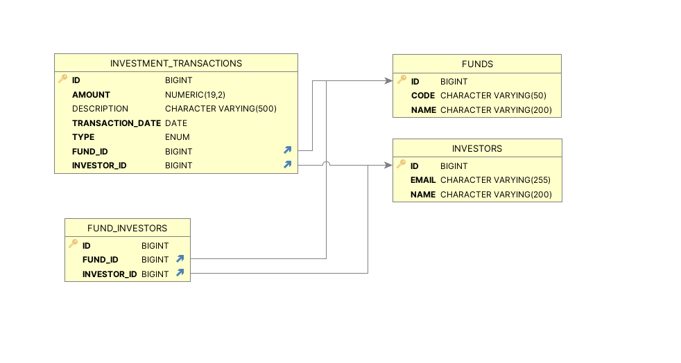

# Ark Investment Management API

A REST API for managing investment funds, investors, transactions, and financial reporting.

This application was developed as a backend implementation of an investment management platform where investors may participate in multiple funds and execute credit and debit transactions against those funds.

## Technology Stack

- Java 21
- Spring Boot 3
- Spring Web
- Spring Data JPA / Hibernate
- H2 Database
- Bean Validation
- Spring Boot Actuator
- OpenAPI / Swagger
- JUnit 5
- MockMvc
- Gradle

## Running the Application

### Requirements

Java 21 is required.

Verify Java is installed:

```bash
java -version
```

### Start the application

From the project root:

```bash
./gradlew bootRun
```

The API will start on:

```text
http://localhost:8080
```

No external database or additional infrastructure is required.

The application uses an embedded H2 database that is created automatically when the application starts.

## API Documentation

Interactive API documentation is available through Swagger UI:

```text
http://localhost:8080/swagger-ui.html
```

The OpenAPI specification is available at:

```text
http://localhost:8080/v3/api-docs
```

Swagger UI can be used to execute requests directly against the application.

## Health Check

Application health can be verified using Spring Boot Actuator:

```text
GET http://localhost:8080/actuator/health
```

Expected response:

```json
{
  "status": "UP"
}
```

## Domain Model

## Domain Model

The application models the many-to-many relationship between funds and
investors explicitly through the `FUND_INVESTORS` table. Transactions
represent financial activity performed by an investor against a specific fund.



### Fund

Represents an investment fund.

A fund may contain multiple investors.

### Investor

Represents an investor participating in one or more funds.

An investor may participate in multiple funds.

### Fund Investor

Represents the many-to-many relationship between funds and investors.

The relationship is modeled explicitly rather than using a direct JPA `@ManyToMany` association. This allows the relationship to evolve independently if additional business attributes are required in the future.

### Investment Transaction

Represents a financial transaction executed by an investor against a fund.

Each transaction contains:

- Fund
- Investor
- Transaction type
- Amount
- Transaction date
- Description

An investor must be associated with a fund before a transaction can be executed against that fund.

## Transaction Types

The following transaction types are supported:

| Transaction Type | Effect |
|---|---|
| Contribution | Credit |
| Interest Income | Credit |
| Distribution | Debit |
| General Expense | Debit |
| Management Fee | Debit |

Transaction amounts are stored as positive monetary values. The transaction type determines whether the amount represents a credit or debit.

All monetary values use Java `BigDecimal` to avoid floating-point precision issues.

## API Overview

### Funds

```text
POST   /api/funds
GET    /api/funds
GET    /api/funds/{id}
PUT    /api/funds/{id}
DELETE /api/funds/{id}
```

### Investors

```text
POST   /api/investors
GET    /api/investors
GET    /api/investors/{id}
PUT    /api/investors/{id}
DELETE /api/investors/{id}
```

### Fund Investors

```text
POST   /api/funds/{fundId}/investors/{investorId}
GET    /api/funds/{fundId}/investors
DELETE /api/funds/{fundId}/investors/{investorId}
```

### Transactions

```text
POST   /api/transactions
GET    /api/transactions
GET    /api/transactions/{id}
PUT    /api/transactions/{id}
DELETE /api/transactions/{id}

GET    /api/transactions/fund/{fundId}
GET    /api/transactions/investor/{investorId}
```

### Reporting

```text
GET /api/reports/funds/{fundId}/summary
GET /api/reports/investors/{investorId}/summary
```

## Example Workflow

The easiest way to explore the application is through Swagger UI `http://localhost:8080/swagger-ui/index.html`.

### 1. Create a fund

```json
{
  "code": "GROWTH-001",
  "name": "Growth Fund"
}
```

### 2. Create an investor

```json
{
  "name": "Jane Smith",
  "email": "jane.smith@example.com"
}
```

### 3. Associate the investor with the fund

Assuming both resources were assigned ID `1`:

```text
POST /api/funds/1/investors/1
```

### 4. Create a contribution (Credit)

```json
{
  "fundId": 1,
  "investorId": 1,
  "type": "CONTRIBUTION",
  "amount": 100000.00,
  "transactionDate": "2026-08-10",
  "description": "Initial contribution"
}
```

### 5. Create a distribution (Debit)

```json
{
  "fundId": 1,
  "investorId": 1,
  "type": "DISTRIBUTION",
  "amount": 15000.00,
  "transactionDate": "2026-08-10",
  "description": "Investor distribution"
}
```

### 6. Retrieve the fund report

```text
GET /api/reports/funds/1/summary
```

Example response:

```json
{
  "fundId": 1,
  "fundCode": "GROWTH-001",
  "fundName": "Growth Fund",
  "totalCredits": 100000.00,
  "totalDebits": 15000.00,
  "netBalance": 85000.00,
  "investorCount": 1,
  "transactionCount": 2
}
```

## Business Rules

The application enforces several domain rules:

- Fund codes must be unique.
- Investor email addresses must be unique.
- An investor may participate in multiple funds.
- A fund may contain multiple investors.
- Duplicate fund/investor associations are not allowed.
- An investor must belong to a fund before executing a transaction against it.
- Transaction amounts must be greater than zero.
- Transaction types determine whether transactions are credits or debits.
- Invalid requests return consistent API error responses.

## Reporting

Fund reports provide:

- Total credits
- Total debits
- Net balance
- Number of investors
- Number of transactions

Investor reports provide:

- Total credits
- Total debits
- Net position
- Number of associated funds
- Number of transactions

The net position is calculated as:

```text
Total Credits - Total Debits
```

## Testing

Run all automated tests with:

```bash
./gradlew test
```

The integration test suite uses a separate in-memory H2 database and covers API behavior, persistence, validation, fund/investor relationships, transaction processing, and reporting calculations.

## Database

The application uses an embedded H2 database to keep the project completely self-contained.

Application data is stored under:

```text
./data/
```

The database is created automatically and does not need to be configured before running the application.

The H2 console is available at:

```text
http://localhost:8080/h2-console
```

Connection settings:

```text
JDBC URL: jdbc:h2:file:./data/arkdb;AUTO_SERVER=TRUE
Username: sa
Password: <blank>
```

Database files are intentionally excluded from source control so every checkout starts with a clean environment.

## Error Handling

API errors use a consistent response structure.

Example:

```json
{
  "timestamp": "2026-08-10T20:00:00Z",
  "status": 404,
  "error": "Not Found",
  "message": "Fund not found: 999",
  "path": "/api/funds/999",
  "validationErrors": null
}
```

Validation failures include field-specific validation errors.

## Architecture

The application is implemented as a modular Spring Boot application with clear separation between HTTP, business, and persistence concerns.

```text
REST Controller
      |
      v
Service / Business Logic
      |
      v
Spring Data Repository
      |
      v
H2 Database
```

The codebase is organized by business domain rather than by a single application-wide controller/service/repository package.

## Design Considerations

### Monetary Precision

Financial amounts are represented using `BigDecimal` rather than floating-point types to preserve decimal precision.

### Fund/Investor Relationship

The many-to-many relationship between funds and investors is represented by an explicit `FundInvestor` entity. This allows additional relationship attributes to be introduced later without restructuring the domain model.

### Transaction Effects

Credit/debit behavior is defined by the transaction type itself, keeping financial rules centralized rather than duplicating conditional logic throughout the application.

### DTO Separation

JPA entities are not exposed directly through the REST API. Request and response DTOs provide separation between the persistence model and external API contract.

### Persistence

H2 was selected to make the assessment self-contained and immediately runnable. In a production environment, the persistence layer can be migrated to a production relational database such as PostgreSQL with minimal application-level changes.

## Potential Production Enhancements

- Authentication and role-based authorization
- Database migrations using Flyway or Liquibase
- PostgreSQL or another production-grade relational database
- Pagination and sorting for collection endpoints
- Date-range filtering for financial reports
- Audit trails
- Transaction reversal/adjustment workflows
- Optimistic locking
- Containerization
- CI/CD pipeline
- Observability and structured logging